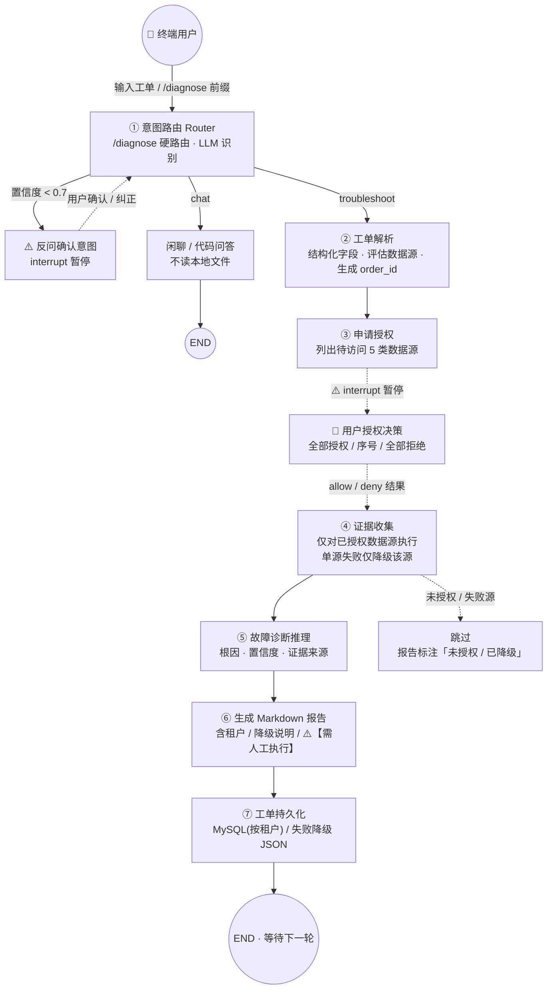
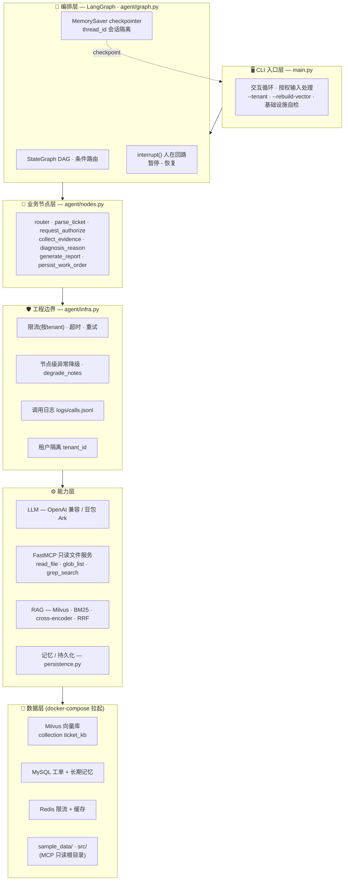
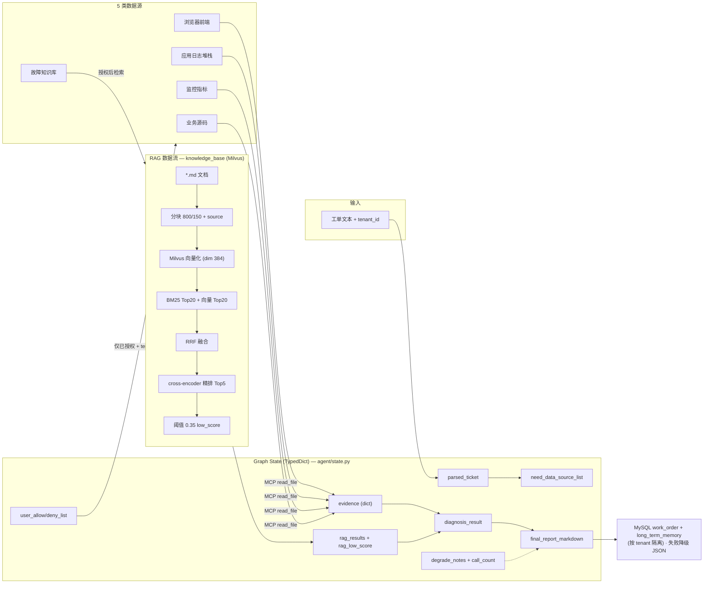

# SaaS 工单故障排查智能体 —— LangGraph 独立可运行 Demo

> **项目定位**：本项目为 **个人 POC 原型**，模拟企业工单故障处理的 Skill Agent，
> **未接入真实生产工单系统**，用于技术作品集演示与架构验证。
> 它是原 `skills/ticket-troubleshooting` Trae Skill 版本的独立工程化重实现，
> 脱离 Trae IDE、可独立运行、可上传 GitHub 供他人复现。

## 业务场景

模拟 **SaaS 运维工单故障智能处理 Agent**：用户粘贴一份故障工单（含现象、报错、堆栈、涉及服务），
智能体走「工单解析 → 评估数据源并向用户申请授权（人在回路）→ 证据收集（MCP 只读 + 知识库 RAG）
→ 故障诊断推理 → 输出标准化 Markdown 故障报告」全流程。

- **工单查询 / 故障分类**：解析工单实体，评估需要访问哪几类数据源；
- **知识库 RAG 检索**：从故障知识库（Runbook / 历史案例 Markdown）召回相关案例并精排，附来源溯源；
- **Skill 工具调用**：通过独立 FastMCP 只读文件服务采集前端/日志/监控/源码证据；
- **工单自动回复**：生成固定模板的 Markdown 诊断报告，修复建议全部标注 `⚠️【需人工执行】`。

## 技术栈

> 本仓库**实际**为 Python 实现，技术栈如实如下（便于他人按代码复现）：
> Python 3.10+ · LangGraph · LangChain · FastMCP · Milvus · MySQL · Redis · Docker Compose · sentence-transformers · rank_bm25

| 层 | 组件 | 说明 |
|---|---|---|
| 编排 | LangGraph (StateGraph DAG) | 显式节点 + 条件路由，MemorySaver checkpoint，`interrupt()` 人在回路 |
| LLM | LangChain + OpenAI 兼容 | `.env` 适配豆包 Seed API（Ark 网关） |
| 工具 | FastMCP 只读文件服务 | `read_file`/`glob_list`/`grep_search`，路径白盒校验，禁写禁删禁 shell 禁网络 |
| 向量库 | Milvus (standalone) | docker-compose 拉起，BM25 + 向量双路召回 + RRF + cross-encoder 精排 |
| 关系库 | MySQL 8 | 工单持久化 + 长期记忆（按租户隔离），无 DB 时降级 JSON |
| 缓存/限流 | Redis 7 | LLM 限流（按租户滑窗）+ 会话缓存，无 Redis 时进程内退化 |
| 部署 | Docker Compose | 一键拉起 Milvus + MySQL + Redis，带健康检查 |

> **企业对标架构（附录，非本仓库实现）**：生产侧可用 SpringBoot + LangGraph4j(Java) + Milvus + MySQL + Redis
> 承载真实工单系统；本 Python POC 用同一套数据模型与流程近似实现，用于快速验证 Agent 编排与工程边界设计。

## 核心特性

- **意图路由（Router）**：`/diagnose` 前缀代码层硬路由直接进入故障排查（不经过 LLM）；其余输入由 LLM 识别 `troubleshoot / chat / code`，置信度 < 0.7 时 `interrupt` 反问用户确认。
- **LangGraph DAG 状态机**：显式节点 + 条件路由，`MemorySaver` 做 checkpoint，`thread_id` 隔离会话，非简单链式调用。
- **人在回路授权（Human-in-the-Loop）**：基于 `langgraph.interrupt()` 暂停 graph，等待终端用户输入授权指令后才恢复；Agent 无法自动调用任何 MCP 工具。
- **独立 FastMCP 只读文件服务（代码层硬限制）**：仅暴露 `read_file` / `glob_list` / `grep_search`；代码层面禁止写文件、删除、执行 shell、网络请求；路径 `resolve()` 后白盒校验，仅允许 `sample_data/` 与 `src/`，越界直接拒绝。
- **完整 RAG 知识库链路（Milvus + 轻量组件）**：Markdown 语义分块（800/150）→ Milvus 持久化 → BM25 + 向量两路召回（各 Top20）→ RRF 融合 → cross-encoder 精排 Top5 → 相关性阈值 0.35；所有片段携带 `source` 元数据用于报告溯源，抑制幻觉。支持 `--rebuild-vector` 重建。
- **工程边界**：租户隔离（所有外部查询强制 `tenant_id`）、LLM 限流/超时/重试、MCP 超时/重试、节点级异常降级（不抛堆栈）、调用日志（prompt/token/工具入参出参）。
- **记忆模块**：短期会话记忆缓存本轮 RAG 结果/证据；本地长期记忆记录历史工单摘要（推理时仅作参考提示，禁止直接复用根因）。
- **工单持久化**：每次诊断完成序列化 state 关键内容到 MySQL（`work_order` / `long_term_memory` 两表，按租户隔离），并追加长期记忆。
- **固定 Markdown 报告模板**：修复建议全部标记 `⚠️【需人工执行】`，禁止输出可直接运行的 shell / sql 命令；报告展示知识库引用来源、租户与降级说明。

## 系统架构图

### 业务架构图

端到端业务流程，突出**意图路由**与**人在回路授权**两个关键交互点，以及节点级降级。



### 技术架构图

五层分层架构：CLI → LangGraph 编排 → 业务节点 → 能力层（LLM / FastMCP / RAG / 记忆 / 基础设施）→ 数据层。



### 数据架构图

State 字段流转、5 类数据源到证据的映射、RAG 内部流水线、基础设施读写与持久化输出。



## 目录结构

```
langgraph_demo/
├─ .env.example          # 环境变量样例（仅占位符）
├─ pyproject.toml        # 工程元信息（依赖见 requirements.txt）
├─ requirements.txt      # 依赖清单
├─ docker-compose.yml    # Milvus + MySQL + Redis 一键拉起
├─ init.sql              # MySQL 建表脚本（自动挂载）
├─ mcp_file_server.py    # FastMCP 只读文件服务（代码层安全限制）
├─ agent/
│   ├─ __init__.py
│   ├─ state.py          # Graph State（含 tenant_id/rag/记忆/降级 字段）
│   ├─ prompts.py        # 各子 Agent 系统提示词（Router/Chat/Parse/Diagnosis）
│   ├─ nodes.py          # 业务节点 + MCP 客户端 + LLM 工厂 + 报告模板 + 降级
│   ├─ graph.py          # StateGraph DAG 组装 + MemorySaver
│   ├─ rag.py            # RAG：Milvus + BM25 + RRF + cross-encoder
│   ├─ persistence.py    # 工单持久化（MySQL 优先，降级 JSON）+ 长期记忆
│   └─ infra.py          # Milvus/MySQL/Redis 客户端 + 限流 + 调用日志 + 重试
├─ logs/                 # 调用日志（自动生成，已 gitignore）
├─ work_order_history/   # 降级模式 JSON 工单记录（自动生成，已 gitignore）
└─ main.py               # CLI 入口：--tenant · --rebuild-vector · 交互循环

（上级目录，已存在，复用）
sample_data/  # frontend_samples / sample_tickets / monitor_samples / knowledge_base
src/          # order-service 模拟业务源码
```

## 工作流

```
START → router
          │ (条件路由)
          ├─ troubleshoot → parse_ticket → request_authorize(interrupt) → collect_evidence
          │                  → diagnosis_reason → generate_report → persist_work_order → END
          └─ chat → chat_respond → END
```

1. `router`：`/diagnose` 前缀硬路由；否则 LLM 识别意图，置信度 < 0.7 时 interrupt 反问确认。
2. `parse_ticket`：解析工单 → 结构化字段 + 评估需要访问的数据源 + 生成 `order_id`。
3. `request_authorize`：输出授权申请话术 → **interrupt 暂停**，等待终端用户输入（全部授权 / 序号 / 全部拒绝）→ 填充 allow/deny。
4. `collect_evidence`：仅对已授权数据源收集证据——
   - `knowledge_base` 走 **RAG 检索**（Query 由工单实体组装，带 tenant 过滤）；
   - 其余四类走 MCP 只读工具读取文件；拒绝的或失败的单源直接跳过并写降级记录。
5. `diagnosis_reason`：综合全部证据做根因推理，输出根因 + 置信度 + 证据来源；**只能使用 RAG 返回片段内的知识库知识**，检索分数过低明确告知无匹配案例。
6. `generate_report`：填充固定 Markdown 模板，输出含租户、知识库引用来源、降级说明的报告。
7. `persist_work_order`：序列化 state 关键内容到 MySQL（按租户），失败降级 JSON，并追加长期记忆。

## 快速启动（一键复现）

### 1. 拉起基础设施（Milvus + MySQL + Redis）

```bash
cd langgraph_demo
docker compose up -d --wait     # 拉起并等待健康检查通过（Milvus 首次启动约 1~2 分钟）
docker compose ps               # 确认 milvus / mysql / redis 均 healthy
```

> 不装 Docker？也可只装 Python 依赖跑 CLI——Milvus/MySQL/Redis 不可用时 RAG/持久化/限流会自动降级，主流程仍可跑通（详见「工程边界」）。

### 2. 安装依赖

> 需要 Python ≥ 3.10。`sentence-transformers` 会拉取 CPU 版 `torch`（体积较大），首次构建向量库会下载嵌入/精排模型。

```bash
python -m venv .venv
# Windows
.venv\Scripts\activate
# macOS / Linux
source .venv/bin/activate

pip install -r requirements.txt
```

### 3. 配置 .env

```bash
cp .env.example .env
```

编辑 `.env`，填写豆包 API 信息（**禁止硬编码到代码**）：

```
API_KEY=你的豆包API Key
BASE_URL=https://ark.cn-beijing.volces.com/api/v3
MODEL_NAME=doubao-seed-1-6-250715
TENANT_ID=default            # 租户标识（也可用 --tenant 覆盖）
# Milvus/MySQL/Redis 默认 localhost，docker-compose 已对齐
```

### 4. 运行 Demo

```bash
python main.py                 # 首次自动构建 Milvus 向量库（下载模型，请稍候）
python main.py --rebuild-vector # 强制重建向量库后进入循环
python main.py --tenant 888     # 指定租户（所有查询带 tenant_id=888）
```

启动后进入交互循环：

1. 输入 `/diagnose ...` 强制进入故障排查；或直接输入故障描述（由 Router 判定意图）；
2. 输入 `sample` 载入内置示例工单（晚高峰下单 504 场景）；
3. Agent 解析工单后会在「申请授权」处暂停，打印需要访问的数据源清单；
4. 按提示输入授权指令：
   - `全部授权` —— 允许读取全部申请的数据源（含知识库 RAG 检索）
   - `1、2、5` —— 仅授权第 1、2、5 项
   - `全部拒绝` —— 不读取任何本地文件，仅基于文本分析
5. Agent 收集证据（MCP + RAG）→ 推理根因 → 输出最终 Markdown 报告 → 持久化为工单记录；
6. 完成一轮后回到输入提示；输入 `exit` 退出。

### 5. 停止与清理

```bash
docker compose down       # 停止容器（保留数据）
docker compose down -v    # 连同数据卷一并清理
```

## 安全说明

- MCP 文件服务的安全完全由**代码层硬限制**实现，不依赖大模型 prompt：
  - 三个工具函数体内只调用只读 API（`read_bytes` / `read_text` / `Path.glob` / `re`）；
  - `_resolve_allowed()` 对所有传入路径 `resolve()` 后强制白盒比对，越界抛 `PermissionError`；
  - 允许目录仅 `sample_data/` 与 `src/`，无法向上跳出项目根目录。
- Agent 侧：LLM 不绑定任何工具，仅产出文本 / JSON；MCP 工具与 RAG 检索只能在 `collect_evidence_node` 内对**已授权**数据源执行，机制上保证「先授权后读取」。
- RAG 返回片段均携带 `source` 元数据，报告可溯源；诊断 prompt 约束不得使用检索片段之外的知识库知识，抑制幻觉。

## 工程边界

| 维度 | 实现 | 降级策略 |
|---|---|---|
| 租户隔离 | 所有 MCP/RAG/持久化查询强制 `tenant_id`（`infra.resolve_tenant`，缺失退化为 `default`） | — |
| LLM 限流 | 按租户滑窗计数（Redis `INCR+EXPIRE`，无 Redis 进程内退化） | 超限拒绝调用并写降级记录 |
| LLM 超时/重试 | `with_retry` 指数退避 + `asyncio.wait_for` 超时 | 失败由节点 try/except 降级（闲聊/路由/解析/诊断各兜底） |
| MCP 超时/重试 | `with_retry` + `MCP_TIMEOUT` | 单源失败仅降级该源，不阻断其他源 |
| 异常降级 | 每个节点 try/except 包裹，写 `degrade_notes` | 绝不抛堆栈中断主流程，报告第 9 节列出降级 |
| 调用日志 | `infra.log_call` 记录 component/tenant/prompt/工具入参出参/token | 日志失败静默，不影响主流程 |
| 基础设施 | Milvus/MySQL/Redis 客户端懒加载，连接失败返回 None | Milvus 不可用→跳过 RAG；MySQL 不可用→JSON 落盘；Redis 不可用→进程内限流 |

## 局限性

- 仅 CLI，无 Web 界面（前端拖拽工作流评估为「性价比低」，暂不做；如需可视化可用 Langflow 加载同款 graph）。
- 未接入真实生产工单系统，样本数据为模拟（`sample_data/`）。
- RAG 用轻量本地组件（Milvus + rank_bm25 + sentence-transformers），向量库为 CPU 嵌入。
- 当证据不足，诊断 Agent 会降低置信度并提示证据不足，不编造根因。

---

## 开发过程遇到的问题 & 修正（重点）

> 这一节记录 AI 生成代码中的**真实缺陷**与本人修正，体现对生成代码的审阅与工程化把关。

### 1. `mcp 2.x` 移除了 `fastmcp` extra，导致服务端 import 失败
- **现象**：AI 初版用 `from mcp.server.fastmcp import FastMCP`，在 mcp 2.x 下该路径已不存在，启动 MCP 服务即报 `ImportError`。
- **修正**：服务端改用独立包 `from fastmcp import FastMCP`；客户端仍用 `from mcp import ClientSession, StdioServerParameters`。在 [requirements.txt](requirements.txt) 将 `mcp` 锁在 `>=1.29.0,<2.0.0` 保证与 `fastmcp>=3.0.0` 协议互通。

### 2. Windows GBK 控制台中文 / emoji 乱码
- **现象**：报告中的中文与 `⚠️` 在 PowerShell 默认 GBK 码页下输出乱码。
- **修正**：[main.py](main.py) 与 [mcp_file_server.py](mcp_file_server.py) 启动时调用 `SetConsoleOutputCP(65001)` + `stream.reconfigure(encoding="utf-8")`，强制 UTF-8 输出。

### 3. Chroma → Milvus 迁移：schema / 召回 / 去重均需重写
- **问题 a（schema）**：Chroma 用 `get_or_create_collection` 即可存元数据；Milvus 需显式 `create_schema` 声明 `id/vector/text/source/section/tenant_id` 字段 + `AUTOINDEX`/`COSINE` 索引，AI 直接套用 Chroma 写法会丢字段或无法过滤。
- **问题 b（BM25 全量回查）**：BM25 需要全量语料；Milvus 用 `client.query(filter=..., limit=10000)` 回查，且必须带 `tenant_id` 过滤，否则跨租户泄露。
- **问题 c（双路去重 id）**：BM25 与向量召回返回的 chunk id 不一致会导致 RRF 融合失败。改为用 `source + text 哈希` 生成稳定 `_chunk_id`，统一两路 id 空间。
- **修正**：见 [agent/rag.py](agent/rag.py) 的 `_ensure_collection` / `_all_chunks_from_store` / `_vector_recall` / `_chunk_id`。

### 4. cross-encoder 输出是 logit，不能直接当相关性分数用
- **现象**：AI 初版把 `CrossEncoder.predict` 的原始值当 score，与 0.35 阈值不可比，导致 `rag_low_score` 判定全错。
- **修正**：对 raw logit 做 `sigmoid` 归一到 0~1 再与阈值比较（[agent/rag.py](agent/rag.py) `_rerank`）。

### 5. LangGraph `interrupt` 检测与恢复写法
- **问题**：AI 初版误用 `graph.ainvoke` 的返回值判断暂停；实际暂停状态在 `snapshot.tasks[*].interrupts`。
- **修正**：[main.py](main.py) 用「检测 `interrupts` → 读终端输入 → `Command(resume=...)` 恢复」的通用循环，统一处理**两个** interrupt 点（路由低置信反问、数据源授权）。

### 6. LLM 输出 JSON 容错
- **问题**：LLM 偶尔在 JSON 外加解释文字或用裸代码块，`json.loads` 直接抛异常导致节点崩。
- **修正**：[agent/nodes.py](agent/nodes.py) `_extract_json` 依次尝试 ` ```json 块 / 裸 ``` 块 / 截取首个 `{` 到末个 `}``，再失败则节点走兜底结构化结果 + 写降级记录。

### 7. 修复建议清洗黑名单不完整
- **问题**：AI 初版只过滤 `rm`，遗漏 `redis-cli` / `DROP` / `kubectl` 等，可能输出可运行命令。
- **修正**：[agent/nodes.py](agent/nodes.py) `_RUNNABLE_PREFIXES` 扩充覆盖常用危险命令，命中改为「描述操作意图」并强制前置 `⚠️【需人工执行】`。

### 8. 工程边界：限流 / 降级 / 日志缺失
- **问题**：AI 原型节点裸调 `llm.ainvoke` / `mcp.call`，无超时无重试无限流无日志，API 抖动即整轮失败。
- **修正**：新增 [agent/infra.py](agent/infra.py)：
  - LLM 限流按租户滑窗（Redis `INCR+EXPIRE`，无 Redis 进程内退化）；
  - `with_retry` 统一指数退避 + `wait_for` 超时，包住 LLM 与 MCP；
  - `log_call` 记录 prompt / 工具入参出参 / token（`extract_tokens` 兼容 `usage_metadata` 与 `response_metadata.token_usage`）；
  - 每个节点 try/except 包裹，失败写 `degrade_notes` 入报告第 9 节，绝不抛堆栈。

### 9. 基础设施客户端「缓存失败」导致中途起服务不重连
- **问题**：若客户端把连接失败缓存为 `None`，Milvus 在流程中途才起来就永远连不上。
- **修正**：`get_milvus/get_mysql/get_redis` 仅缓存成功连接，失败不缓存——下次调用重新尝试，保证「基础设施晚就绪也能被拾起」。

### 10. MySQL 持久化与租户隔离
- **问题**：AI 原型直接写 JSON 文件，无租户隔离、无可查询性。
- **修正**：[agent/persistence.py](agent/persistence.py) 改 MySQL 主路径（`work_order` / `long_term_memory` 两表，`tenant_id` 列 + 索引，查询强制 `WHERE tenant_id=%s`），`ensure_mysql_schema` 幂等建表；MySQL 不可用时自动降级回 JSON + jsonl。
