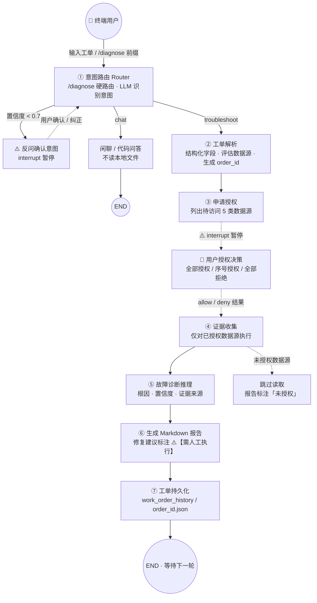
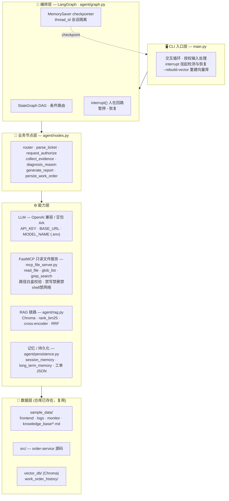
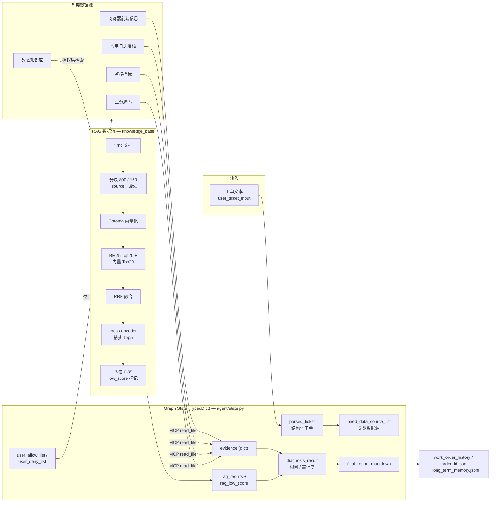

# SaaS 工单故障排查智能体 —— LangGraph 独立可运行 Demo

脱离 Trae IDE 的独立 Python 工程，复用仓库根目录下的真实样本数据（`sample_data/`、`src/`），
基于 **LangGraph DAG 状态机 + 意图路由 + FastMCP 只读文件服务 + 人在回路授权 + RAG 知识库检索**
实现完整的工单排查流程。

> 本 Demo 是原 `skills/ticket-troubleshooting` Trae Skill 版本的独立工程化重实现，
> 报告模板与安全铁律与 Skill 版本完全一致。

## 核心特性

- **意图路由（Router）**：`/diagnose` 前缀代码层硬路由直接进入故障排查（不经过 LLM）；其余输入由 LLM 识别 `troubleshoot / chat / code`，置信度 < 0.7 时 `interrupt` 反问用户确认。
- **LangGraph DAG 状态机**：显式节点 + 条件路由，`MemorySaver` 做 checkpoint，`thread_id` 隔离会话，非简单链式调用。
- **人在回路授权（Human-in-the-Loop）**：基于 `langgraph.interrupt()` 暂停 graph，等待终端用户输入授权指令后才恢复；Agent 无法自动调用任何 MCP 工具。
- **独立 FastMCP 只读文件服务（代码层硬限制）**：仅暴露 `read_file` / `glob_list` / `grep_search`；代码层面禁止写文件、删除、执行 shell、网络请求；路径 `resolve()` 后白盒校验，仅允许 `sample_data/` 与 `src/`，越界直接拒绝。
- **完整 RAG 知识库链路（轻量本地组件，开箱即用）**：Markdown 语义分块（800/150）→ Chroma 持久化向量库 → BM25 + 向量两路召回（各 Top20）→ RRF 融合 → cross-encoder 精排 Top5 → 相关性阈值 0.35；所有片段携带 `source` 元数据用于报告溯源，抑制幻觉。支持 `--rebuild-vector` 重建。
- **记忆模块**：短期会话记忆缓存本轮 RAG 结果/证据；本地长期记忆记录历史工单摘要（推理时仅作参考提示，禁止直接复用根因）。
- **工单持久化**：每次诊断完成序列化 state 关键内容为 `work_order_history/<order_id>.json`，并追加长期记忆。
- **OpenAI 兼容 LLM**：通过 `.env` 适配豆包 Seed API（Ark 网关）。
- **固定 Markdown 报告模板**：修复建议全部标记 `⚠️【需人工执行】`，禁止输出可直接运行的 shell / sql 命令；报告展示知识库引用来源。

## 目录结构

```
langgraph_demo/
├─ .env.example          # 环境变量样例（仅占位符）
├─ pyproject.toml        # 工程元信息（依赖见 requirements.txt）
├─ requirements.txt      # 依赖清单
├─ mcp_file_server.py    # FastMCP 只读文件服务（代码层安全限制）
├─ agent/
│   ├─ __init__.py
│   ├─ state.py          # Graph State 状态结构体（含 RAG/记忆/order_id 字段）
│   ├─ prompts.py        # 各子 Agent 系统提示词（Router/Chat/Parse/Diagnosis）
│   ├─ nodes.py          # 业务节点 + MCP 只读客户端 + LLM 工厂 + 报告模板
│   ├─ graph.py          # StateGraph DAG 组装（路由 + 排查子图）+ MemorySaver
│   ├─ rag.py            # RAG 链路：分块 + Chroma + BM25 + 向量 + RRF + cross-encoder
│   └─ persistence.py    # 工单持久化 + 长期记忆
├─ vector_db/            # Chroma 向量库（自动生成，已 gitignore）
├─ work_order_history/   # 工单持久化记录（自动生成，已 gitignore）
└─ main.py               # CLI 入口，交互循环，--rebuild-vector

（上级目录，已存在，复用）
sample_data/  # frontend_samples / sample_tickets / monitor_samples / knowledge_base
src/          # order-service 模拟业务源码
```

## 工作流

```
START → router
          │ (条件路由)
          ├─ troubleshoot → parse_ticket → request_authorize(interrupt) → collect_evidence
          │                  → diagnosis_reason → generate_report → persist_work_order → END
          └─ chat → chat_respond → END
```

1. `router`：`/diagnose` 前缀硬路由；否则 LLM 识别意图，置信度 < 0.7 时 interrupt 反问确认。
2. `parse_ticket`：解析工单 → 结构化字段 + 评估需要访问的数据源 + 生成 `order_id`。
3. `request_authorize`：输出授权申请话术 → **interrupt 暂停**，等待终端用户输入（全部授权 / 序号 / 全部拒绝）→ 填充 allow/deny。
4. `collect_evidence`：仅对已授权数据源收集证据——
   - `knowledge_base` 走 **RAG 检索**（Query 由工单实体组装，非原始输入）；
   - 其余四类走 MCP 只读工具读取文件；拒绝的直接跳过。
5. `diagnosis_reason`：综合全部证据做根因推理，输出根因 + 置信度 + 证据来源；**只能使用 RAG 返回的片段内的知识库知识**，检索分数过低明确告知无匹配案例。
6. `generate_report`：填充固定 Markdown 模板，输出含知识库引用来源的报告。
7. `persist_work_order`：序列化 state 关键内容到 `work_order_history/<order_id>.json` 并追加长期记忆。

## 架构图

> 以下三张图分别从 **业务流程**、**技术分层**、**数据流转** 三个视角描述本 Demo；
> 节点命名与代码（`agent/graph.py`、`agent/nodes.py`、`agent/state.py`、`agent/rag.py`）一一对应。

### 业务架构图

从用户输入到报告落库的端到端业务流程，重点突出 **意图路由** 与 **人在回路授权** 两个关键交互点。



### 技术架构图

五层分层架构：CLI 入口 → LangGraph 编排 → 业务节点 → 能力层（LLM / FastMCP / RAG / 记忆）→ 数据层。



### 数据架构图

State 字段流转、5 类数据源到证据的映射、以及 RAG 内部数据流水线与持久化输出。



## 安装依赖

> 需要 Python ≥ 3.10。RAG 依赖会拉取 CPU 版 `torch`（体积较大），首次构建向量库会下载嵌入/精排模型。

```bash
cd langgraph_demo
python -m venv .venv
# Windows
.venv\Scripts\activate
# macOS / Linux
source .venv/bin/activate

pip install -r requirements.txt
```

## 配置 .env

```bash
cp .env.example .env
```

编辑 `.env`，填写豆包 API 信息（**禁止硬编码到代码**）：

```
API_KEY=你的豆包API Key
BASE_URL=https://ark.cn-beijing.volces.com/api/v3
MODEL_NAME=doubao-seed-1-6-250715
LLM_TIMEOUT=60
```

## 运行 Demo

```bash
python main.py                 # 首次自动构建向量库（下载模型，请稍候）
python main.py --rebuild-vector # 强制重建知识库向量库后进入循环
```

启动后进入交互循环：

1. 输入 `/diagnose ...` 强制进入故障排查；或直接输入故障描述（由 Router 判定意图）；
2. 输入 `sample` 载入内置示例工单（晚高峰下单 504 场景）；
3. Agent 解析工单后会在「申请授权」处暂停，打印需要访问的数据源清单；
4. 按提示输入授权指令：
   - `全部授权` —— 允许读取全部申请的数据源（含知识库 RAG 检索）
   - `1、2、5` —— 仅授权第 1、2、5 项
   - `全部拒绝` —— 不读取任何本地文件，仅基于文本分析
5. Agent 收集证据（MCP + RAG）→ 推理根因 → 输出最终 Markdown 报告 → 持久化为工单记录；
6. 完成一轮后回到输入提示；输入 `exit` 退出。

## 安全说明

- MCP 文件服务的安全完全由**代码层硬限制**实现，不依赖大模型 prompt：
  - 三个工具函数体内只调用只读 API（`read_bytes` / `read_text` / `Path.glob` / `re`）；
  - `_resolve_allowed()` 对所有传入路径 `resolve()` 后强制白盒比对，越界抛 `PermissionError`；
  - 允许目录仅 `sample_data/` 与 `src/`，无法向上跳出项目根目录。
- Agent 侧：LLM 不绑定任何工具，仅产出文本 / JSON；MCP 工具与 RAG 检索只能在 `collect_evidence_node` 内对**已授权**数据源执行，机制上保证「先授权后读取」。
- RAG 返回片段均携带 `source` 元数据，报告可溯源；诊断 prompt 约束不得使用检索片段之外的知识库知识，抑制幻觉。

## 局限性

- 仅 CLI，无 Web 界面。
- RAG 用轻量本地组件（Chroma + rank_bm25 + sentence-transformers），不部署 Elasticsearch / Milvus。
- 向量库构建（离线）直接读取知识库文件；运行时 Agent 仅在授权后才执行检索。
- 当证据不足，诊断 Agent 会降低置信度并提示证据不足，不编造根因。
